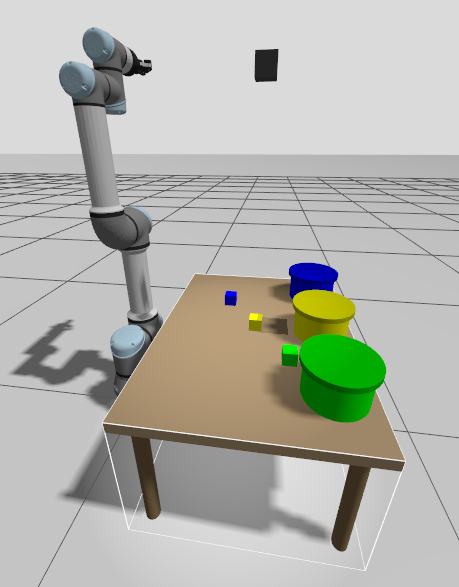
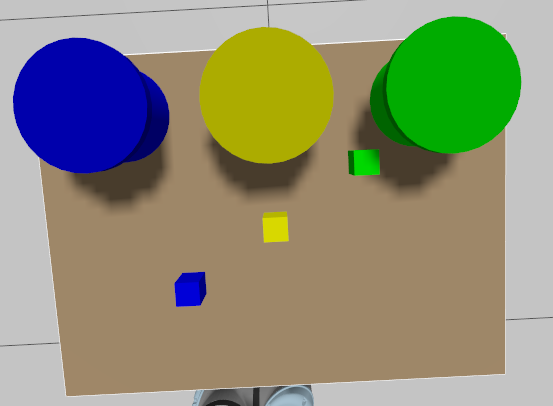
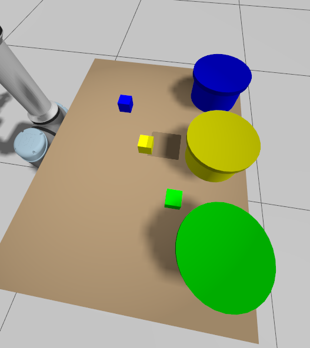
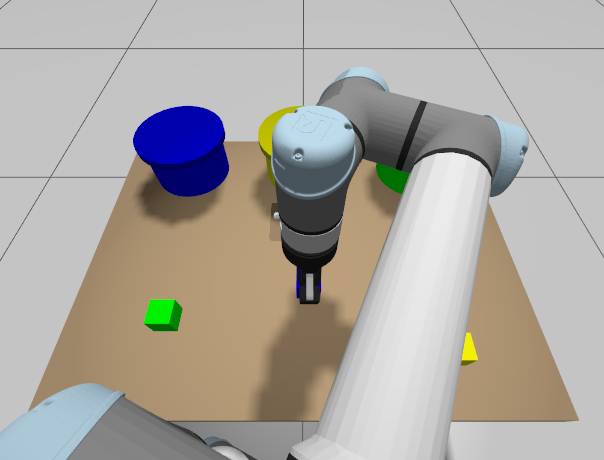

# EcoSort — Vision-Guided Waste Sorting with a UR5e Manipulator (ROS 2 / Gazebo / MoveIt 2)

EcoSort is a ROS 2 simulation in which a **Universal Robots UR5e** arm fitted
with a **Robotiq 2F-85** gripper identifies small colored cubes on a table
using an overhead camera, and sorts each one into the matching colored bin —
**blue → paper, yellow → plastic, green → glass**. Objects can be placed at
**arbitrary positions** on the table for each run; the robot has no prior
knowledge of where they are and relies entirely on live camera detection.

This repository contains the ROS 2 packages that make up the project
(simulation world/robot, MoveIt 2 configuration, color-based perception, and
the pick-and-place logic), plus setup/run instructions, dependency lists,
sample output, and a validation report.

## Table of contents

- [Demo](#demo)
- [How it works](#how-it-works)
- [Repository layout](#repository-layout)
- [Requirements](#requirements)
- [Dependencies](#dependencies)
- [Setup](#setup)
- [Running the simulation](#running-the-simulation)
- [Configuration files](#configuration-files)
- [Validation results](#validation-results)
- [Known limitations](#known-limitations)
- [Troubleshooting](#troubleshooting)
- [Author](#author)

## Demo

| | |
|---|---|
|  Full scene: UR5e on its table, three color-coded bins, and three cubes at random positions. |  The same layout from directly above — this is effectively what the overhead camera used for detection sees. |
|  Objects are spawned at random (x, y) positions each run; the robot must find them from vision alone, not fixed coordinates. |  The UR5e approaching a detected cube to grasp it, mid pick-and-place cycle. |

More detail on what was tested, and with what results, is in
[`docs/VALIDATION.md`](docs/VALIDATION.md).

## How it works

The system is split into four ROS 2 packages, each with one clear
responsibility:

```
 overhead camera (Gazebo)
        │  /ecosort/camera/image_raw
        ▼
 ecosort_perception (color_detector.py)
   HSV segmentation + pinhole deprojection
        │  /ecosort/detected/{papel,plastico,vidrio}  (3D world points)
        ▼
 ecosort_pick_place (pick_place_node.cpp)
   decides WHAT to pick, WHERE (from the topics above), and in what order
        │  MoveGroupInterface (Cartesian + joint-space planning)
        ▼
 ecosort_moveit_config (move_group)
   robot kinematics/collision model, OMPL motion planning
        │  FollowJointTrajectory / GripperCommand actions
        ▼
 ecosort_sim (ros2_control + gz_ros2_control)
   executes the trajectories on the simulated UR5e + Robotiq 2F-85 in Gazebo
```

1. `ecosort_sim` launches Gazebo with the world (table, robot, camera, three
   bins, three cubes) and starts the arm/gripper controllers.
2. `ecosort_perception`'s `color_detector` node watches the camera feed
   continuously and publishes the estimated 3D position of each detected
   cube, updated every frame.
3. `ecosort_moveit_config` launches `move_group`, which knows the robot's
   kinematics and collision geometry and can plan collision-free paths.
4. `ecosort_pick_place` waits briefly for the first detections, then, for
   each waste category still present on the table, picks up the corresponding
   cube from wherever the camera currently reports it and places it in its
   bin. A category with no detection is skipped (no fixed fallback position
   is used).

## Repository layout

```
EcoSort/
├── README.md                     <- this file
├── docs/
│   ├── VALIDATION.md             <- test methodology + real results
│   └── media/                    <- screenshots referenced above
└── src/
    ├── ecosort_sim/              <- Gazebo world, robot URDF/xacro, ros2_control config, main launch file
    ├── ecosort_moveit_config/    <- SRDF, kinematics/planning/controller config for MoveIt 2
    ├── ecosort_perception/       <- camera-based color detection node (Python)
    └── ecosort_pick_place/       <- pick-and-place decision + motion logic (C++)
```

This mirrors a normal ROS 2 workspace `src/` folder. See
[Setup](#setup) for how to build it.

## Requirements

Minimum software to run this project:

| Requirement | Version used in development |
|---|---|
| OS | Ubuntu 24.04 LTS (Noble Numbat) |
| ROS 2 distribution | Jazzy Jalisco |
| Simulator | Gazebo Sim (Harmonic) — `gz sim`, tested with 8.11.0 |
| Motion planning | MoveIt 2 (Jazzy binaries), OMPL (RRTConnect) |
| Build tool | colcon |
| Python | 3.12 |

Hardware this was developed and tested on (a reasonable practical baseline,
not a hard-measured minimum): Intel Core i5-1135G7 (4 cores / 8 threads),
8 GB RAM, integrated GPU. Gazebo's GUI needs a working OpenGL desktop session
(local display or an X11-forwarding/VNC setup) — it will not run on a
headless server without one. Disk: allow a few GB free for ROS 2 + Gazebo
system packages, plus the third-party robot description packages cloned in
[Setup](#setup) (roughly 100 MB).

## Dependencies

### ROS 2 / system packages (apt)

Assuming ROS 2 Jazzy is already installed and sourced:

```bash
sudo apt update
sudo apt install \
  ros-jazzy-desktop \
  ros-jazzy-ros-gz \
  ros-jazzy-gz-ros2-control \
  ros-jazzy-ros2-control \
  ros-jazzy-ros2-controllers \
  ros-jazzy-moveit \
  ros-jazzy-moveit-planners-ompl \
  ros-jazzy-moveit-simple-controller-manager \
  ros-jazzy-warehouse-ros-sqlite \
  ros-jazzy-xacro \
  ros-jazzy-cv-bridge \
  python3-opencv \
  python3-numpy \
  python3-colcon-common-extensions
```

### Third-party ROS packages (cloned as source, not vendored in this repo)

Two robot-description packages are required but are **not included** in this
repository, since they are third-party projects with their own history/size
(~100 MB combined) rather than code written for EcoSort. Clone them into the
same workspace `src/` folder as the four `ecosort_*` packages:

```bash
cd ~/ecosort_ws/src   # wherever you cloned this repo's src/ into, see Setup
git clone -b main https://github.com/UniversalRobots/Universal_Robots_ROS2_Description.git
git clone https://github.com/PickNikRobotics/ros2_robotiq_gripper.git
```

(If either default branch above has moved on, use whatever branch/tag your
ROS 2 Jazzy distro's documentation currently points to for that package —
these two provide the UR5e and Robotiq 2F-85 URDF/xacro models and are not
maintained as part of this project.)

### Python packages

`opencv-python`/`numpy` are covered by the apt packages above
(`python3-opencv`, `python3-numpy`). If you prefer pip in a virtualenv
instead, `opencv-python>=4.6` and `numpy` are the only extra imports beyond
the ROS 2 Python client library (`rclpy`) and `cv_bridge`.

## Setup

```bash
# 1. Create a workspace and put this repo's contents in its src/ folder
mkdir -p ~/ecosort_ws
cd ~/ecosort_ws
git clone <this-repo-url> tmp_clone
mv tmp_clone/src src
mv tmp_clone/docs .
mv tmp_clone/README.md .
rm -rf tmp_clone

# 2. Add the two third-party dependencies (see Dependencies above)
cd src
git clone -b main https://github.com/UniversalRobots/Universal_Robots_ROS2_Description.git
git clone https://github.com/PickNikRobotics/ros2_robotiq_gripper.git
cd ..

# 3. Install any remaining ROS dependencies automatically
source /opt/ros/jazzy/setup.bash
rosdep update
rosdep install --from-paths src --ignore-src -r -y

# 4. Build
colcon build

# 5. Source the workspace (repeat in every new terminal you use it from)
source install/setup.bash
```

## Running the simulation

The system runs as **three separate terminals**, each responsible for one
stage of the pipeline (world/body → motion planning → decision logic). In
every terminal:

```bash
cd ~/ecosort_ws
source install/setup.bash
```

**Terminal 1 — Gazebo, the robot, and the camera/vision node**

```bash
ros2 launch ecosort_sim sim.launch.py
```

Wait for Gazebo to fully open and the arm/gripper controllers to report
active before continuing.

**Terminal 2 — MoveIt 2**

```bash
ros2 launch ecosort_moveit_config moveit.launch.py
```

Wait for `move_group` to finish initializing (its log settles and RViz, if
shown, is ready).

**Terminal 3 — pick-and-place**

```bash
ros2 launch ecosort_pick_place pick_place.launch.py
```

This node waits a few seconds internally to give the first camera detections
time to arrive, then starts the cycle: for each of paper/plastic/glass still
present on the table, it picks the most recently detected position for that
color and places it in the matching bin.

## Configuration files

| File | Purpose |
|---|---|
| `ecosort_sim/worlds/ecosort_world.sdf` | The Gazebo world: table, three color-coded bins, three cubes, overhead camera (position/FOV), lighting. |
| `ecosort_sim/urdf/my_robot.urdf.xacro` | Robot description: UR5e + Robotiq 2F-85, ros2_control hardware interfaces. |
| `ecosort_sim/config/controllers.yaml` | ros2_control controller manager config (joint trajectory controller for the arm, position controller for the gripper). |
| `ecosort_sim/launch/sim.launch.py` | Orchestrates Terminal 1: robot_state_publisher → Gazebo → ROS–Gazebo bridges (camera, clock) → color-vision node → robot spawn → controllers. |
| `ecosort_moveit_config/srdf/ecosort.srdf.xacro` | MoveIt planning groups, allowed self-collisions, named poses. |
| `ecosort_moveit_config/config/kinematics.yaml` | IK solver selection/settings. |
| `ecosort_moveit_config/config/joint_limits.yaml` | Velocity/acceleration limits used by planning. |
| `ecosort_moveit_config/config/ompl_planning.yaml` | OMPL planner selection (RRTConnect) and per-group planning parameters. |
| `ecosort_moveit_config/config/moveit_controllers.yaml` | Maps MoveIt trajectory execution to the ros2_control controllers above. |
| `ecosort_perception/ecosort_perception/color_detector.py` | HSV color ranges, camera intrinsics/geometry, contour-area thresholds — all the tunable perception parameters live at the top of this file. |
| `ecosort_pick_place/src/pick_place_node.cpp` | Grip-close/open positions, grasp-verification threshold, planning tolerances, per-category bin poses — the tunable pick-and-place parameters live near the top of this file. |

## Validation results

See [`docs/VALIDATION.md`](docs/VALIDATION.md) for the full report. Summary:
detection and pick-and-place were exercised across multiple runs with
objects at varied, non-fixed positions and with different subsets of the
three categories present. Blue (paper) and green (glass) sorted reliably
across all tested runs; yellow (plastic) succeeded in the large majority of
runs but occasionally failed to grasp firmly or, in one reproducible case
very close to the robot base, failed to find a valid motion plan within the
allotted planning time. See the report for the concrete data (grasp-position
error, grip-sensor values, and the specific known-hard coordinate) and the
mitigations already applied.

## Known limitations

- Grasp success is inferred indirectly, from the real vs. commanded gripper
  finger position on `/joint_states` (there is no dedicated force/pressure
  sensor in this simulation) — this catches most failed grasps but not all.
- One specific region of the table, very close to the robot base on the
  negative-Y side, is a known hard case for motion planning (see
  `docs/VALIDATION.md`); it was mitigated but not fully eliminated.
- If an object of a given color is placed after the pick-and-place node has
  already concluded that category is absent, it will not retroactively be
  picked up in that same run.
- Detection assumes the camera has an unobstructed view of each cube (no
  handling for one cube fully occluding another of a different color).

## Troubleshooting

- **`gz service` calls time out / nothing seems to respond**: usually means
  no `gz sim` process is actually running, or stray processes from a
  previous run are still alive. Check with
  `ps aux | grep -E "gz sim|pick_place_node|parameter_bridge|move_group"`
  and kill any leftover PIDs before relaunching.
- **`pick_place_node` cannot construct the robot model / "Unable to parse
  SRDF"**: Terminal 2 (`moveit.launch.py`) needs to be fully up before
  Terminal 3 is started.
- **Launch command apparently not found / `file 'None' was not found`**:
  usually a copy-pasted command got line-wrapped into two separate shell
  lines. Each `ros2 launch <package> <file>.launch.py` above is a single
  command.

## Author

- Sebastián Gaibor - sgaibor@espol.edu.ec
- Jennifer Martínez - jenammar@espol.edu.ec
- Luis Velez - luifevel@espol.edu.ec
